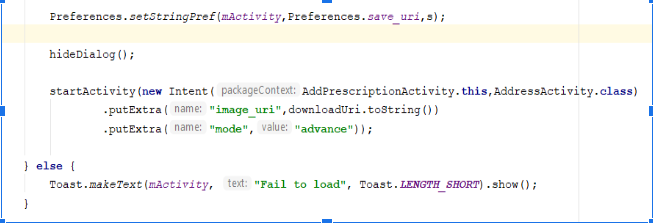

## The Starks
<!-- TOC depthFrom:1 depthTo:6 withLinks:1 updateOnSave:1 orderedList:0 -->
- [The Starks](#the-starks)
	- [Group Memebers](#group-members) 
	- [Installation Notes](#installation-notes)
		- [Requirements](#requirements)
	- [Download Links](#download-links)
	- [Project Execution Instruction](#project-execution-instruction)
	- [Summary](#summary)
	- [Users](#users)
	- [Features](#features)
		- [Profile Management](#profile-management) 
		- [Search Medicine](#search-medicine)
		- [Find Store](#find-store)
		- [Upload Prescription](#upload-prescription)
		- [Set Reminder](#set-reminder)
		- [User Cart](#user-cart)
		- [User Order History](#user-order-history)
		- [Manage Inventory](#manage-inventory)
		- [Accept/Reject User Order](#accept-reject-user-order)
	- [Libraries](#libraries)
	- [High-level Organization](#High_level_Organization)
	- [Layout](#layout)
	- [Final Project Status](#Final_Project_Status)
	- [Code Example](#Code_Example)
	- [Functionality Decomposition](#Functionality_Decomposition)
	- [Implementation](#Implementation)
	- [Future Work](#future-work)
	- [Sources](#Sources)
<!-- /TOC -->

###  Group members

| Name                       | B00 number | Email               |
| -------------------------- | ---------- | ------------------- |
| Pranay Gheewala			 | B00826923  | pranay.gheewala@dal.ca      |
| Mohit Kacha	             | B00804879  | mohit@dal.ca     |
| Karan Thakkar              | B00823819  | kr527589@dal.ca	     |
							
				


## Installation Notes
Installation instructions for markers
### Requirements
Require Software to run project 

 - **Android Studio** : Android Studio require to open project. Project will build in Android studio using gradle files. The project will be built on Android studio
 - **Java** : Java Language is used in this project. Java must installe on machine

### Download Links

 - Android Studio - [Download here](https://developer.android.com/studio)
 - Java - [Download here](https://www.java.com/en/download/)
 - Git - [Download here](https://git-scm.com/downloads)

### Project Execution Instruction

Git repository of the project here  
  
- If system has git installed then create git clone or download the zip version
```sh
git clone
```
- Import project in Android studio
- Run Project on Emulator or Device

## Summary
E-commerce is the platform for all the necessary items like food, clothes or electronics in today’s digital world. In this fast world almost, everything is available online but there are minimal platforms where user can get medicines delivered to their doorsteps. So here is the solution to this problem, an android application, 'MediCare', where the customer can buy the desired medicine according to the availability in the store, request for the medicine and set a reminder when and which medicine to take. The main aim to develop this android application is easy availability of medicines to many users who don't have time in their busy schedule or for disabled users or old aged people. Easy access to medicines serves the purpose not only to the customers but also to doctors in case of shortage of supplies.

## Introduction
Many times, we tend to forget to restock medicines which we take every day. This is most common in old aged or disabled people. Also, it would not be feasible sometimes for pregnant women to buy the medicines they need by physically going to the store. Hence, we then plan to develop a medicine ordering application in which users can buy medicine online according to the availability of the medicine offered by the shops.

The application will target a specific user-base i.e it will be used only in India because the common practice in India is the doctor just gives the prescription, sometimes even the photo of the prescription is sent by the family doctor and often the medicines prescribed by the doctor is not in stock in the nearest store. Also, old-aged people, pregnant people, or other people who have problems like diabetes have to regularly take some medicine every day and due to some reason, they tend to forget to refill their medicines. So, using the application user will be able to search the medicine by names and can order from the store.

## Users

The target users of our application will be people who are currently living in India. Main users for the MediCare application are: “End users/ Customers” and “Pharmacist”.

The intended scenarios for different user persona(s) for this application are listed below:
1. The customer can search for any medicine at MediCare which will offer 24*7 services showing the price and available quantity of medicine available from the Pharmacist. To order anything customer simply needs to follow the following steps:

	a.) Initially, all the users of Medicare must register themselves. Log in with the valid credentials and
the user will get redirected to the homepage. The user can search for the medicines or products that do not require prescription and can be sold without prescription and then add that to the shopping cart. Multiple products could be added to the shopping cart after this user will be asked  to check out. Select the delivery address and the medicine will be delivered to the doorsteps. 

	b.) Users can also just upload the prescription given by the doctor in the application and add the delivery address and send it to the medical store. The medical store will see the prescription check for its authenticity in the application built for them and deliver all the medicines prescribed by the doctor in the prescription to the doorsteps. This process avoids false medications. He can then accept or reject the order.
	
2. Medicare also offers the facility for Profile Management, and main features included are Change the delivery address, purchase history, etc.

3. The pharmacist will add the inventory details of the medicines. 
 

## Features

### Profile Management

- **User Registration (Sign up)**: User can create a new account by giving Name, Email id, Birthdate, Address, and password.

- **User Login (Sign In)**: User can sign in with valid credential.

- **Store Login(Medical store Sign in):** Store owner can log in to the application with given credential. The store owner will be provided user id and password to access store application. Currently, the store owner not allow to create a new account.

- **Update Profile**: User can manage their profile. User can change password, birthdate, and address.

### Search Medicine
- User can search for medicine. It will display a list of medicine. User can select any medicince with the required quantity. From here User can add medicine into the cart. From the cart, the user can Confirm order or the user can search for another medicine from inventory.  
- Once the user confirms the order, Application will ask for the user’s address. The user can confirm the order and process for payment.

### Find Store 
- User can search nearest Store location on Google map. It will display all the nearest store on google map

### Upload Prescription
- User can upload prescription in the application. Once user upload prescription user can place an order from here. User can also use this prescription for a future order.

### Set Reminder
- Some people take medicince on a regular basis. This application will help to remind about medicince. User can set Reminder with date and time. The application will use an alarm to remind the user about medicine.

### User Cart
- Cart will display a list of medicince added by the user. User can modify cart by deleting from the cart or adding a new order to the cart. User can place an order from cart also.
- Before adding any product to the cart system will check the availability of the product in inventory and system will ensure inventory has enough product to complete the order request.

### User Order History
- User can see order history in My orders. It will have a list of orders with date, Order id, and status of the order.

### Manage inventory
- Owner of the store can manage inventory from the store application. User can change the quantity of medicine or delete medicince from inventory.

### Accept Reject User order
- When a user place order, Store application will receive an order where the store owner can accept or reject any order from All orders. When store owner accepts or rejects the request, User will receive notification about the order status

## Libraries

**Google map**
- Google map Service API allows android to integrate map in the application. We used the location API to find the current location of the user. With the help of map service, we can add a marker on google map. In find, nearest store functionality application will display marker of the store on map.

**Volley**
- Volley is an HTTP library developed by Google and it makes networking faster and easier for Apps. Volley has a rich feature like automatic scheduling of network request, handle Request and Response of server, asynchronous data fetching. Volley fetch support cache that helps to improve App performance by saving memory and bandwidth of the server. It has a predefined method to fetch JSON data easily and fast.

**Picasso**
- Picasso is powerful image downloading and caching library for android. This application is really fast and optimized. We are using Picasso to download an image from the firebase server, setting an image from the gallery. Picasso used for resizing, scaling and center cropping,

**Gson**
- Gson is a powerful java framework that can be used to convert Java Objects into their JSON representation.[Add reference] It can be used with any networking library. Gson will auto-generate model class. Gson can handle nested class, collection, and generic types. Gson can handle null object field and can highly customizable.


## High-level Organization

Initially, we have created a sitemap for our application which helped us to plan the navigation for the user throughout our application. It shows different views and their linked relationships.


<br/>
<br/>

 &nbsp; &nbsp; &nbsp; &nbsp; &nbsp; &nbsp; &nbsp; &nbsp; &nbsp; &nbsp; 


## Layout

 Initially we have created wireframe for both User Apllication and Medical Store Application which gave us an idea how we would lay our navigation elements.
 
### User Wireframe 
 

 &nbsp; &nbsp; &nbsp; &nbsp; &nbsp; &nbsp; &nbsp; &nbsp; &nbsp; &nbsp; 
 &nbsp;

&nbsp; &nbsp; &nbsp; &nbsp; &nbsp;&nbsp;&nbsp;&nbsp;&nbsp;&nbsp;&nbsp;&nbsp;&nbsp;&nbsp;&nbsp;&nbsp;&nbsp;&nbsp;&nbsp;&nbsp;&nbsp;&nbsp;&nbsp;&nbsp;&nbsp;&nbsp;&nbsp;&nbsp;&nbsp;&nbsp;&nbsp;&nbsp;&nbsp;**Log In Screen** &nbsp; &nbsp; &nbsp; &nbsp; &nbsp;&nbsp;&nbsp;&nbsp;&nbsp;&nbsp;&nbsp;&nbsp;&nbsp;&nbsp;&nbsp;&nbsp;&nbsp;&nbsp;&nbsp;&nbsp;&nbsp;&nbsp;&nbsp;&nbsp;&nbsp;&nbsp;&nbsp;&nbsp;&nbsp;&nbsp;&nbsp;&nbsp;&nbsp;&nbsp;&nbsp;&nbsp;&nbsp;&nbsp;&nbsp;&nbsp;&nbsp;&nbsp;&nbsp;&nbsp;&nbsp;&nbsp;&nbsp;&nbsp;&nbsp;&nbsp;&nbsp;&nbsp;&nbsp;&nbsp;&nbsp;&nbsp;&nbsp;&nbsp;&nbsp;&nbsp;&nbsp;&nbsp;&nbsp;&nbsp;&nbsp;&nbsp;&nbsp;&nbsp;&nbsp;&nbsp;&nbsp;&nbsp;&nbsp;&nbsp;&nbsp;&nbsp;&nbsp;&nbsp;&nbsp;&nbsp;&nbsp;&nbsp;&nbsp;&nbsp;&nbsp; **Sign Up Screen**
<br/>
<br/>
<br/>
<br/>
            
 &nbsp; &nbsp; &nbsp; &nbsp; &nbsp; &nbsp; &nbsp; &nbsp; &nbsp; &nbsp; 
 &nbsp;
            
&nbsp;&nbsp;&nbsp;&nbsp;&nbsp;&nbsp;&nbsp;&nbsp;&nbsp;&nbsp;&nbsp;&nbsp;&nbsp;&nbsp;&nbsp;&nbsp;&nbsp;&nbsp;&nbsp;&nbsp;&nbsp;&nbsp;**Forgot Password Screen** &nbsp; &nbsp; &nbsp; &nbsp; &nbsp;&nbsp;&nbsp;&nbsp;&nbsp;&nbsp;&nbsp;&nbsp;&nbsp;&nbsp;&nbsp;&nbsp;&nbsp;&nbsp;&nbsp;&nbsp;&nbsp;&nbsp;&nbsp;&nbsp;&nbsp;&nbsp;&nbsp;&nbsp;&nbsp;&nbsp;&nbsp;&nbsp;&nbsp;&nbsp;&nbsp;&nbsp;&nbsp;&nbsp;&nbsp;&nbsp;&nbsp;&nbsp;&nbsp;&nbsp;&nbsp;&nbsp;&nbsp;&nbsp;&nbsp;&nbsp;&nbsp;&nbsp;&nbsp;&nbsp;&nbsp;&nbsp;&nbsp;&nbsp;&nbsp;&nbsp;&nbsp;&nbsp;&nbsp;&nbsp;&nbsp;&nbsp;&nbsp;&nbsp;&nbsp;&nbsp;&nbsp;&nbsp;&nbsp;&nbsp;&nbsp; **User Dash Board**
<br/>
<br/>
<br/>
<br/>

 &nbsp; &nbsp; &nbsp; &nbsp; &nbsp; &nbsp; &nbsp; &nbsp; &nbsp; &nbsp; 
 &nbsp;

&nbsp; &nbsp; &nbsp; &nbsp; &nbsp;&nbsp;&nbsp;&nbsp;&nbsp;&nbsp;&nbsp;&nbsp;&nbsp;&nbsp;&nbsp;&nbsp;&nbsp;&nbsp;&nbsp;&nbsp;&nbsp;&nbsp;&nbsp;&nbsp;&nbsp;&nbsp;**User Navigation Drawer** &nbsp; &nbsp; &nbsp; &nbsp; &nbsp;&nbsp;&nbsp;&nbsp;&nbsp;&nbsp;&nbsp;&nbsp;&nbsp;&nbsp;&nbsp;&nbsp;&nbsp;&nbsp;&nbsp;&nbsp;&nbsp;&nbsp;&nbsp;&nbsp;&nbsp;&nbsp;&nbsp;&nbsp;&nbsp;&nbsp;&nbsp;&nbsp;&nbsp;&nbsp;&nbsp;&nbsp;&nbsp;&nbsp;&nbsp;&nbsp;&nbsp;&nbsp;&nbsp;&nbsp;&nbsp;&nbsp;&nbsp;&nbsp;&nbsp;&nbsp;&nbsp;&nbsp;&nbsp;&nbsp;&nbsp;&nbsp;&nbsp;&nbsp;&nbsp;&nbsp;&nbsp;&nbsp;&nbsp;&nbsp;&nbsp;&nbsp;&nbsp;&nbsp; **My Order Screen**
<br/>
<br/>
<br/>
<br/>
<br/>
<br/>

### Medical Store Wireframe
 &nbsp; &nbsp; &nbsp; &nbsp; &nbsp; &nbsp; &nbsp; &nbsp; &nbsp; &nbsp; 
 &nbsp;

&nbsp; &nbsp; &nbsp; &nbsp; &nbsp;&nbsp;&nbsp;&nbsp;&nbsp;&nbsp;&nbsp;&nbsp;&nbsp;&nbsp;&nbsp;&nbsp;&nbsp;&nbsp;&nbsp;&nbsp;&nbsp;&nbsp;&nbsp;&nbsp;&nbsp;**Medical Store DashBoard** &nbsp; &nbsp;&nbsp;&nbsp;&nbsp;&nbsp;&nbsp;&nbsp;&nbsp;&nbsp;&nbsp;&nbsp;&nbsp;&nbsp;&nbsp;&nbsp;&nbsp;&nbsp;&nbsp;&nbsp;&nbsp;&nbsp;&nbsp;&nbsp;&nbsp;&nbsp;&nbsp;&nbsp;&nbsp;&nbsp;&nbsp;&nbsp;&nbsp;&nbsp;&nbsp;&nbsp;&nbsp;&nbsp;&nbsp;&nbsp;&nbsp;&nbsp;&nbsp;&nbsp;&nbsp;&nbsp;&nbsp;&nbsp;&nbsp;&nbsp;&nbsp;&nbsp;&nbsp;&nbsp;&nbsp;&nbsp;&nbsp;&nbsp;&nbsp;&nbsp;&nbsp;&nbsp;&nbsp;&nbsp;&nbsp; **Medical Store Add Medicine**
<br/>
<br/>
<br/>
<br/>

 &nbsp;


&nbsp; &nbsp; &nbsp; &nbsp; &nbsp;&nbsp;&nbsp;&nbsp;&nbsp;&nbsp;&nbsp;&nbsp;&nbsp;&nbsp;&nbsp;&nbsp;&nbsp;&nbsp;**Medical Store Review Order**

<br/>
<br/>
<br/>

## Final Project Status
- General user app Functionality
 1. User will be able to search for the medicine, add in the cart and place the order using cash on delivery option. (completed)
 2. Upload prescription option will allow users to upload the prescription (completed)
 
- Expected Functionality
 1. The application will provide a reminder functionality which will help the user to remind about the medicines that they need to take. (completed)
 2. The application will provide a GPS map service which will show nearby medical stores where users can go and physically buy the medicines. Also, the user can get an idea whether the medicine is available at that store and at what price by searching the medicine. (completed)
 
- Bonus Functionality
 1. Users will get personalized recommendations of medicines based on their purchase history. (Not completed)
 2. Real Payment module can be integrated which will provide benefit to make payment using our application. (Not completed)
 3. User will be able to register and login to the application. (completed)
 4. The pharmacist will be able to add or edit the inventory of medicines (completed)
 5. The pharmacist will be able to accept or reject the order of the customer (completed)

## Code Example
- Problem 1: Main problem was in user data-base management, how to set two way orders. We gave solution using “give mode” of orders and made changes same as in back-end side
<br/>
<br/>
- Problem 2: Alarm manager notification : problem to get notification in higher level OS version devices.
<br/>
- Problem 3: Problem in how to save arraylist in shared preference
<br/>
<br/>
<br/>

## Functionality Decomposition
- We have followed Model-View-Controller and Restful API services for our project.
- The basic idea in it is to separate internal data models from the user interface via the controller and view. It is dominating web and mobile development, and although some alternatives exist, almost all relevant server-side software is developed with an MVC-compliant (or an MVC-variant-compliant) framework.
<br/>

1. Model:
It represents all data related logic of our application.
In our project, all data related to medicines, nearest medical store, user information, come under the section modal. 
 

2. View: 
It represents UI logic of our application.
All the screens of UI come under this section. E.g., Home screen, navigation drawer, all the other screens.

3. Controller:
It is an interface between model and view components. It handles incoming requests, manipulate the data using the Model component, and interact with a view to get the final output.
For our project, Files like MainActivity.java, MedicineActivity.java, MedicineDetailActivity.java, AddPrescriptionActivity.java etc. are the example of controller.
 

4. Rest API:
It is handling the transformation of data between the server and the application. As well as it is responsible for data interaction between the user application and the admin application.
 

5. Adapters and Handlers:
Additionally, we have added handlers and adapters.
<br/>

## Implementation

### 1. User

### Login screen:- 
From this screen, the user can login and create a new account from sign up options and also user can forgot password via verified email id.<br/>

### Sign Up screen :- 
Create a new account from this page.<br/>


### Home screen


<br/>

*  There are four main options:
    * Search Medicine:
    Will allow the user to search the medicine via scrolling down or the user can search for medicine by name using search bar.
    <br/>
    * Set Reminder
    User will be asked for the medicine name to be taken and enter the time for the alarm.
    <br/>        
    * Nearest Medical store
    Will allow the user to search for the nearest medical store using Google Map API.
    <br/>
    * Upload prescription
    Will allow the user to upload prescription via camera or using the phone gallery.
    User also will be allowed to see saved prescription.
    <br/>

*  Left side drawer menu
    * Home
    * Search Medicine
    * Cart
    * My Orders
    * See the profile from profile picture click
    * Logout<br/><br/>
<br/>
<br/>

*  Action bar option with cart: 
    
    *  show cart items and place orders
     <br/>

### 2. Admin

### Home Page

<br/><br/>

*  There are two options:
    * Add Medicine: Admin will be allowed to add inventory of any medicine 
      <br/>
    * Review Order: Admin will be able to see the orders from the user as well as can accept or reject the order.
      <br/>
      
<br/> by clicking on the order, admin can see the order details


## Future Work

 - User application will have a online payment service where user can pay using credit or debit card services
 - User application can have a recommendation algorithm which will recommend medicines or products based on the user's purchase history
 - Medical store can limit purchase of a particular user to a limited quantity per user  
 - We will keep a feedback form or ratings option about a particular product
 - User can cancel the product by giving appropriate reason and if the store owner agrees he will refund the money
 - User can chat with the store owner regarding the product or any issues regarding the product
 

All these functionalities would polish the application if we had more time to implement it

## Sources

[1] Medicine free vector icons designed by itim2101. (2019). Retrieved 25 July 2019, from https://www.flaticon.com/free-icon/medicine_1560870

[2] Suggestions free vector icons designed by Flat Icons. (2019). Retrieved 25 July 2019, from https://www.flaticon.com/free-icon/suggestions_1484601

[3] Medicine free vector icons designed by Flat Icons. (2019). Retrieved 25 July 2019, from https://www.flaticon.com/free-icon/medicine_1496949#term=medicine&page=1&position=2

[4] google/gson. (2019). Retrieved 25 July 2019, from https://github.com/google/gson

[5] API services & MVC — Futurice. (2019). Retrieved 25 July 2019, from https://www.futurice.com/blog/api-services-mvc/

[6] "MVC Framework Introduction", www.tutorialspoint.com, 2019. [Online]. Available: https://www.tutorialspoint.com/mvc_framework/mvc_framework_introduction.htm. [Accessed: 24-Jul- 2019]

[7] Flaticon, the largest database of free vector icons. (2019). Retrieved 25 July 2019, from https://www.flaticon.com/
